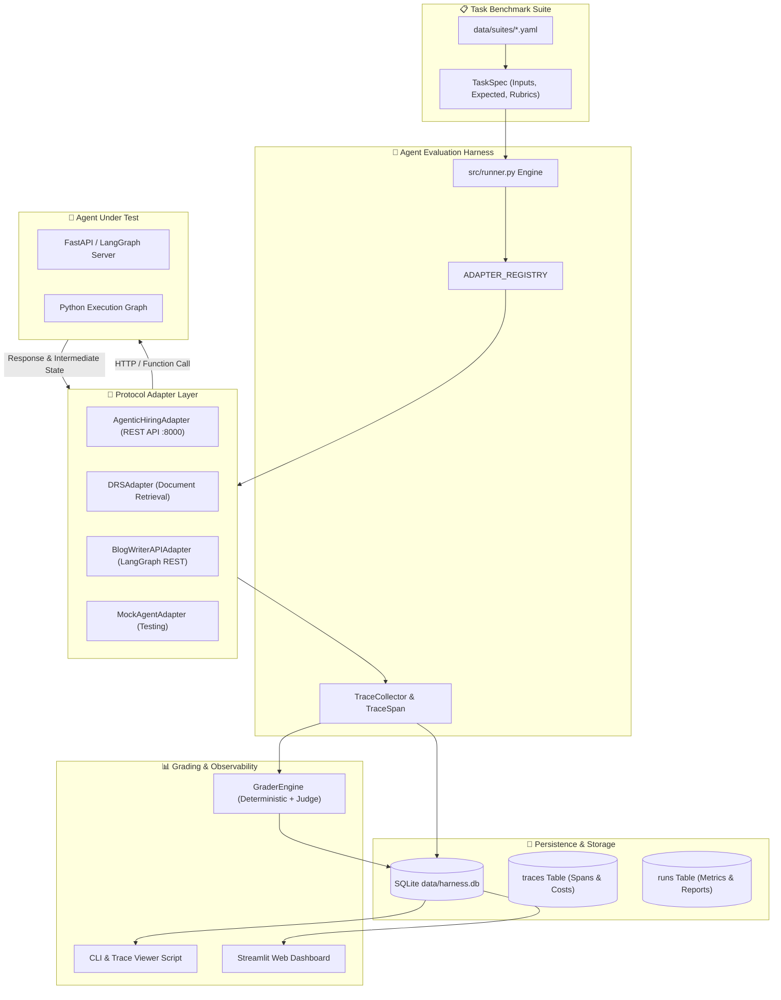

# 🤖 Agent-Harness v1.2 🚀⚡📊

[](https://www.python.org/)
[](https://fastapi.tiangolo.com/)
[](https://streamlit.io/)
[](https://www.langchain.com/)
[](https://docs.pydantic.dev/)
[](https://www.sqlite.org/)
[](LICENSE)

> **The enterprise-grade platform to run, trace, evaluate, grade, and regression-test AI agents across complex multi-step trajectories.**

Evaluating a standard LLM is simple (one prompt in, one response out). Evaluating an **AI Agent** is fundamentally different—agents do not just generate text; they navigate graph states, invoke external tools, execute APIs, and follow dynamic execution loops. 

**Agent-Harness** captures the full execution trajectory of any AI agent (not just the final answer) and benchmarks performance using **deterministic rules**, **LLM-as-a-Judge rubrics**, **cost & latency tracking**, and **automated regression detection**.

---

## 🌟 Key Highlights & Innovations

* 🔍 **Full Trajectory Execution Tracing**: Captures every node transition, tool call, HTTP request, token breakdown (`tokens_in`/`tokens_out`), step-level latency, and estimated USD cost.
* 🔌 **Decoupled Framework-Agnostic Adapters**: Connects any agent architecture (LangGraph, FastAPI REST endpoints, AutoGen, CrewAI, or raw Python loops) via standardized protocol adapters (`AgentAdapter`).
* 🎯 **Two-Tier Grading Engine**:
  * **Level 1 — Deterministic Rule-Based Checks**: Fast, zero-cost keyword matching, schema validation, and constraint checking.
  * **Level 2 — LLM-as-a-Judge Rubric Evaluation**: Deep technical accuracy, clarity, and completeness evaluation using state-of-the-art judge models.
* 📊 **Automated Failure Mode Taxonomy**: Systematically flags agent failures (`WRONG_TOOL`, `INFINITE_LOOP`, `HALLUCINATED_RESULT`, `PREMATURE_TERMINATION`, `CASCADING_ERROR`, `CONTEXT_LOSS`, `MISSED_ISSUE`).
* 🚨 **Automated Regression Signals**: Automatically detects performance degradations, cost spikes, latency increases, or failure rate jumps between agent versions (`v1.0` vs `v1.1`).
* 🎨 **Interactive Streamlit Web Dashboard & Trace Viewer**: Visualize runs, compare metrics side-by-side, view step-by-step execution span trees, and grade interactively.
* 💼 **Native Project Integrations**: Pre-built adapters for **Agentic Hiring Workflow** (port 8000/8501), **Document Retrieval System (DRS)**, and **Blog Researcher & Writer Agent**.

---

## 🏗️ System Architecture & Workflow



---

## 🔍 Execution Tracing & Data Model

When an agent runs a task, **Agent-Harness** captures a hierarchical tree of `TraceEvent` spans:

```json
{
  "trace_id": "trace_hiring_task_001_a03e71",
  "span_id": "span_9281a",
  "parent_span_id": null,
  "node": "jd_generation_agent",
  "type": "llm_call",
  "start_ts": 1784809223100,
  "end_ts": 1784809251267,
  "tokens_in": 250,
  "tokens_out": 800,
  "cost_usd": 0.00150,
  "tool_name": "langgraph_invoke",
  "tool_args": { "role": "Senior AI/ML Engineer", "department": "R&D" },
  "output_summary": "Generated JD for job_id 'b5f4a0a9-e1c9-40e8-a1a0-f8fb231b54a1' (status: PENDING_APPROVAL)",
  "error": null
}
```

### Trace Span Taxonomy

| Span Node Type | Description | Key Attributes Captured |
| :--- | :--- | :--- |
| `api_call` | External HTTP REST request to local or remote server | URL, payload summary, status code, latency |
| `llm_call` | Large Language Model generation step | `tokens_in`, `tokens_out`, model cost (USD), output summary |
| `tool_call` | Invocation of an agentic tool (search, vector index, database) | `tool_name`, `tool_args`, result count, execution duration |
| `state_transition` | Internal graph node state update (LangGraph router, reducer) | Previous state, next node, state mutations |

---

## 🎯 Grading Engine & Failure Taxonomy

### 1. Deterministic Checks (Rule-Based)
Fast, zero-cost, objective validation executed before invoking an LLM judge:
* **Keyword Matching**: Validates required domain keywords in candidate output.
* **Citation Verification**: Asserts that retrieved documents include required sources/citations.
* **Schema Validation**: Ensures JSON responses contain required keys and conform to Pydantic models.

### 2. LLM-as-a-Judge Rubric Grading
Evaluates subjective dimensions using structured LLM prompts:
* **Technical Accuracy (1-5)**: Asserts domain correctness of generated code, JDs, or responses.
* **Clarity & Structure (1-5)**: Evaluates formatting, readability, and organization.
* **Completeness (1-5)**: Verifies all aspects of recruiter or user prompt were answered.

### 3. Trajectory Failure Classification

```text
┌────────────────────────────────────────────────────────────────────────┐
│                        FAILURE TAXONOMY MAP                            │
├───────────────────────┬────────────────────────────────────────────────┤
│ Failure Mode          │ Trigger Condition / Detection                  │
├───────────────────────┼────────────────────────────────────────────────┤
│ WRONG_TOOL            │ Selected inappropriate tool or invalid arguments│
│ HALLUCINATED_RESULT   │ Proceeded as success on tool error / missing data│
│ INFINITE_LOOP         │ Repeated identical tool & args >= 3 times      │
│ PREMATURE_TERMINATION │ Stopped before answering all task constraints  │
│ CASCADING_ERROR       │ Early bad node assumption invalidated output   │
│ CONTEXT_LOSS          │ Overwrote or ignored initial prompt rules      │
│ MISSED_ISSUE          │ Failed to catch domain-specific ground truth   │
└───────────────────────┴────────────────────────────────────────────────┘
```

---

## 🔌 Integrated Agent Projects

**Agent-Harness** includes built-in adapters and evaluation suites for:

### 1. Agentic Hiring Workflow (`agentic_hiring_workflow`)
- **Backend API**: Running on `http://localhost:8000` (FastAPI)
- **Frontend UI**: Running on `http://localhost:8501` (Streamlit)
- **Capabilities Tested**: AI Job Description Generation, PDF compilation, and Hybrid Resume Retrieval (FAISS + BM25 + Cross-Encoder).

### 2. Document Retrieval System (`drs_agent`)
- **Capabilities Tested**: Dense vector search, metadata filtering, document citation generation, and question answering.

### 3. Blog Researcher & Writer (`blog_researcher_writer_agent`)
- **Capabilities Tested**: LangGraph stateful multi-node execution (Router -> Researcher -> Planner -> Parallel Section Workers -> Reducer).

---

## 💻 Tech Stack

| Component | Technology / Library | Purpose |
| :--- | :--- | :--- |
| **CLI & Execution Core** | Python 3.10+, Click, Rich | Command line interface, execution engine, rich terminal rendering |
| **Data Contracts** | Pydantic v2 | Strict schema validation for task specs, trace events, and reports |
| **Storage & Persistence** | SQLite3, `sqlite3` driver | Zero-config relational storage for task suites, trace spans, and runs |
| **LLM Integrations** | Google GenAI SDK, LangChain, OpenAI | Multi-provider LLM support for agent runs and LLM judge scoring |
| **Web Dashboard UI** | Streamlit | Visual benchmark execution dashboard, trace tree view, run comparison |
| **HTTP Communication** | Requests, HTTPX | Synchronous and asynchronous REST calls to agent backends |

---

## ⚙️ Installation & Setup

### Prerequisites
* **Python 3.10+** installed
* **Git** installed
* **OpenAI / OpenRouter / Gemini API Keys**

### 1. Clone the Repository
```bash
git clone https://github.com/saket0x07/Agent-Harness.git
cd Agent-Harness
```

### 2. Environment Setup
Create a `.env` file in the root directory:
```bash
cp .env.example .env
```
Populate `.env` with your API keys:
```env
OPENAI_API_KEY=your_openai_api_key
GOOGLE_API_KEY=your_google_gemini_api_key
OPENROUTER_API_KEY=your_openrouter_api_key

# Database Destination
HARNESS_DB_PATH=data/harness.db
```

### 3. Virtual Environment & Dependencies
```bash
python -m venv .venv
# Activate on Windows:
.\.venv\Scripts\activate
# Activate on Linux/macOS:
source .venv/bin/activate

pip install --upgrade pip
pip install -r requirements.txt
```

---

## 🚀 Running Benchmark Evaluations

### 1. Execute a Benchmark Task Suite (CLI)

Run evaluation against the **Agentic Hiring Workflow** running on port `8000`:
```powershell
python main.py run --suite data/suites/agentic_hiring_suite.yaml --agent agentic_hiring_workflow --version v1.0
```

Run evaluation against the **Document Retrieval System**:
```powershell
python main.py run --suite data/suites/drs_suite.yaml --agent drs --version v1.0
```

### 2. Interactive Single-Query Evaluation

Run an interactive query and watch traces generate in real-time:
```powershell
python main.py interactive --agent agentic_hiring_workflow --version v1.0-interactive
```

### 3. Inspect Detailed Execution Trace Trees

Run the trace viewer script to inspect span-by-span latency, cost, and tool arguments for the latest run:
```powershell
python scripts/view_traces.py
```

### 4. Launch the Web Dashboard UI

Launch the Streamlit web dashboard to visually execute benchmark suites and compare runs:
```powershell
streamlit run streamlit_app.py --server.port 8502
```
Open your web browser at `http://localhost:8502`.

---

## 📝 Task Suite Format (`.yaml`)

Define benchmark tasks under `data/suites/`:

```yaml
tasks:
  - task_id: "hiring_task_001"
    agent_target: "agentic_hiring_workflow"
    input:
      action: "create_job"
      hiring_request:
        role: "Senior AI/ML Engineer"
        department: "AI R&D"
        experience: "5+ years"
        location: "Remote"
        employment_type: "full_time"
        work_mode: "remote"
        required_skills: ["Python", "FastAPI", "LangGraph"]
        preferred_skills: ["FAISS", "Docker"]
    expected:
      required_keywords:
        - "Senior"
        - "AI/ML"
        - "Python"
    grading_strategy:
      - "deterministic_keyword_match"
      - "llm_judge_technical_accuracy"
    difficulty: "medium"
    tags:
      - "hiring"
      - "jd_generation"
```

---

## 📂 Project Structure

```text
Agent-Harness/
├── data/
│   ├── suites/                      # Benchmark Task Suite YAML files
│   │   ├── agentic_hiring_suite.yaml # Agentic Hiring Workflow suite
│   │   ├── drs_suite.yaml            # Document Retrieval System suite
│   │   ├── blog_writer_api_suite.yaml# Blog Writer API suite
│   │   └── sample_suite.yaml         # Reference benchmark suite
│   └── harness.db                    # SQLite Database (runs, tasks, traces, grading)
├── docs/
│   └── connect_new_agent.md         # Step-by-step guide to connect new agent projects
├── scripts/
│   ├── view_traces.py               # Trace span viewer CLI utility
│   ├── compare_versions.py          # Version regression comparison tool
│   └── calibrate_judge.py           # LLM judge calibration script
├── src/
│   ├── adapters/                    # Framework & API Protocol Adapters
│   │   ├── base.py                  # AgentAdapter protocol definition
│   │   ├── agentic_hiring_adapter.py# Adapter for Agentic-Hiring-Workflow (:8000)
│   │   ├── drs_adapter.py           # Adapter for DRS document retrieval
│   │   ├── blog_writer_api.py       # Adapter for Blog Writer API
│   │   └── mock_agent.py            # Mock adapter for unit testing
│   ├── core/
│   │   ├── schemas.py               # Pydantic schemas (TaskSpec, TraceEvent, etc.)
│   │   └── instrumentation.py       # Span collection logic
│   ├── grading/
│   │   ├── grader.py                # GraderEngine orchestrator
│   │   ├── deterministic.py         # Keyword & rule validation checks
│   │   └── judge.py                 # LLM-as-a-Judge rubric engine
│   ├── storage/
│   │   ├── db.py                    # SQLite database migrations & queries
│   │   └── models.py                # Storage data models
│   ├── tracing/
│   │   └── tracer.py                # TraceCollector & trace_span context managers
│   └── runner.py                    # Benchmark runner & ADAPTER_REGISTRY
├── tests/                           # Pytest unit & integration test suite
├── main.py                          # Click CLI entrypoint (run, interactive)
├── streamlit_app.py                 # Streamlit Web Dashboard Application
├── requirements.txt                 # Python dependencies
├── .env.example                     # Environment variables template
└── README.md                        # Project Documentation
```

---

## 🧪 Testing & Verification

Run all unit tests using `pytest`:
```powershell
pytest -v
```

Verify Python syntax across all core modules:
```powershell
python -m py_compile main.py streamlit_app.py src/runner.py
```

---

## 🤝 How to Connect a New Agent

Connecting a new agent project takes 3 steps:

1. **Create a Task Suite**: Define tasks in `data/suites/my_agent_suite.yaml`.
2. **Implement an Adapter**: Inherit from `AgentAdapter` in `src/adapters/my_agent_adapter.py` and implement `run(task)`.
3. **Register in Registry**: Add your class to `ADAPTER_REGISTRY` in `src/runner.py`.

For full step-by-step instructions, see **[docs/connect_new_agent.md](file:///d:/Fxis.ai/Agent-Harness/docs/connect_new_agent.md)**.

---

## Author & License

Developed with ❤️ by **[saket0x07](https://github.com/saket0x07)** for advanced AI agent evaluation, trajectory tracing, and regression testing.

Distributed under the **MIT License**.
