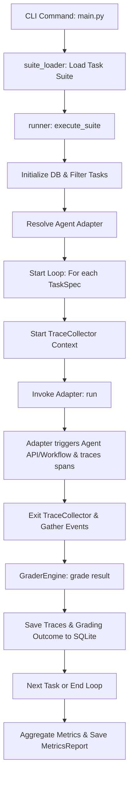

# Codebase Explanation: Agent Evaluation Harness

This document provides a detailed structural and functional overview of the **Agent Evaluation Harness**. The harness is designed to evaluate, benchmark, and trace AI agents in a framework-agnostic manner.

---

## 📂 Project Structure


```text
Agent-Harness/
├── data/
│   ├── suites/
│   │   ├── drs_suite.yaml        # Evaluation tasks for the DRS agent
│   │   └── sample_suite.yaml     # Blog researcher writer agent task suite (31 tasks)
│   └── harness.db                # SQLite database persistence
├── docs/
│   ├── connect_new_agent.md      # Guide to connecting custom agents
│   └── codebase_explanation.md   # This explanation document
├── scripts/
│   └── calibrate_judge.py        # Calibrates subjective LLM judge MAE error delta
├── src/
│   ├── adapters/
│   │   ├── base.py               # AgentAdapter Protocol interface
│   │   ├── blog_writer.py        # Adapter for local LangGraph Blog Writer
│   │   ├── blog_writer_api.py    # Adapter for Blog Writer FastAPI endpoint
│   │   ├── drs_adapter.py        # Adapter for DRS FastAPI endpoint on port 8000
│   │   └── mock_agent.py         # MockAgent simulated adapter paths
│   ├── core/
│   │   └── schemas.py            # Pydantic data models for validation & schemas
│   ├── grading/
│   │   ├── grader.py             # GraderEngine (deterministic & structural audits)
│   │   └── llm_judge.py          # Subjective quality evaluator (OpenRouter/Gemini/Offline)
│   ├── loader/
│   │   └── suite_loader.py       # Parses and validates YAML/JSON task files
│   ├── storage/
│   │   └── db.py                 # SQLite tables initialization & writing helpers
│   ├── tracing/
│   │   └── tracer.py             # Thread-safe execution trace collection
│   └── runner.py                 # Orcherstrates suite runs and persists results
├── tests/
│   ├── test_drs_adapter.py       # DRS adapter unit tests
│   ├── test_phase1.py            # Unit tests for schemas, DB, and loader
│   ├── test_phase2.py            # Unit tests for adapters and tracing
│   ├── test_phase3.py            # Unit tests for CLI commands and runner
│   └── test_phase4.py            # Unit tests for grading engine and LLM judge
├── main.py                       # CLI application entrypoint
├── requirements.txt              # Project package dependencies
└── changes_log.md                # Ongoing change log tracking development history
```

---

## 🔄 Core Workflow

When you trigger a benchmark run via the CLI (e.g. `python main.py run --suite <path> --agent <agent_name>`), the harness goes through the following lifecycle:



---

## 🛠️ Detailed Component Breakdown

### 1. CLI Entry Point (`main.py`)
Utilizes `click` and `rich` to parse parameters, prompt users, and render terminal outputs.
- **`run` Command**: Executes a task suite for an agent, evaluates output, and prints tables showing passed/failed rates.
- **`interactive` Command**: Prompts you for a quick custom input (specifically customized based on whether you are querying a blog agent or the document retrieval system) and runs the pipeline on-the-fly.
- **`compare` Command**: Compares current metrics against stored baselines to detect performance degradations.

### 2. Core Schemas (`src/core/schemas.py`)
Pydantic schemas ensure runtime type safety and contract enforcement:
- `TraceEvent`: Tracks details of a single component execution (node name, type, latency, inputs, outputs, token count, cost, errors).
- `TaskSpec`: Outlines task queries, target agents, expectations, and difficulty levels.
- `AgentResult`: Standardizes outputs returned by adapters.
- `GradingResult`: Relates a run outcome back to its evaluation tests.
- `MetricsReport`: Houses aggregated metrics across a suite execution.

### 3. Database Layer (`src/storage/db.py`)
Encapsulates all interactions with the local SQLite database.
- Schema consists of 5 tables: `tasks`, `runs`, `traces`, `grading_results`, and `baselines`.
- Writes events in bulk, creating an index on `traces(trace_id)` to speed up retrieval.
- Exposes baseline read/write interfaces to record versions for regressions.

### 4. Task Suite Loader (`src/loader/suite_loader.py`)
Iterates over suite files or directories, parsing YAML/JSON files. It validates data fields directly against the Pydantic `TaskSpec` schema, catching syntax discrepancies early.

### 5. Adapter Layer (`src/adapters/`)
Acts as a bridge between the harness and the target agent. By inheriting from `AgentAdapter` (`src/adapters/base.py`), custom adapters transform the standard inputs in `TaskSpec` into the formatting expected by the agent under evaluation.
- `MockAgentAdapter`: Simulates loops, tool crashes, and successes without querying real LLMs.
- `BlogWriterAPIAdapter`: Communicates with a LangGraph workflow server over HTTP, decomposing incoming states into detailed trace paths.
- `DRSAdapter`: Dispatches requests to the Document Retrieval System FastAPI endpoint (`/ask`) on port 8000. It instruments execution with `drs_api_request`, `retriever`, and `llm_generation` spans.

### 6. Tracing System (`src/tracing/tracer.py`)
- `TraceCollector`: Uses `threading.local()` to store span events. It isolates traces when multiple tasks run concurrently.
- `trace_span`: Context manager that records execution timestamps, catches exceptions, compiles tracebacks into the span `error` field, and appends the finalized `TraceEvent` to the local storage.

### 7. Grading Engine (`src/grading/`)
- `GraderEngine` (`grader.py`): Performs deterministic audits:
  - Keyword Matching: Validates that required strings are present.
  - Section Auditing: Validates that headings (detected using regex `#{1,6}\s+.+`) meet minimum constraints.
  - Citation Auditing: Verifies presence of bracketed footnotes (e.g. `[1]`) or URLs.
  - Trajectory Audits: Detects infinite loops (repeating same tool + arguments consecutive $\ge 3$ times) and premature terminations.
- `llm_judge.py`: Implements LLM-as-a-Judge using a robust fallback chain:
  1. OpenRouter (Claude 3.5 Sonnet / Nemotron).
  2. Gemini API (`gemini-1.5-flash` natively via the Google GenAI SDK).
  3. Offline Mock (returns default metrics if no API keys are present).

---

## 🧪 Testing and Calibration

- **Tests**: Grouped by development phases, verifying model validation, database queries, adapter protocols, cli runner commands, grading outcomes, and the DRS adapter.
- **scripts/calibrate_judge.py**: Runs the judge against human-annotated baseline documents (`data/calibration_human_labels.json`) to calculate the Mean Absolute Error (MAE) for clarity, accuracy, and completeness scores.
